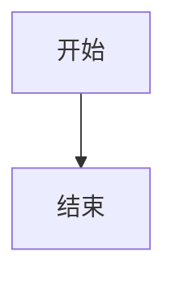

# Markdown转Word文档转换器

这是一个将Markdown文件转换为Word文档(.docx)的Python脚本。

## 功能特性

- ✅ 支持标题层级转换（H1-H4）
- ✅ 支持表格转换
- ✅ 支持代码块转换
- ✅ 支持列表转换（有序和无序）
- ✅ 支持粗体、斜体文本
- ✅ 特殊处理Mermaid代码块
- ✅ 自动设置文档样式
- ✅ 支持中文编码

## 安装依赖

在使用转换器之前，需要安装必要的Python包：

```bash
pip install -r requirements.txt
```

或者手动安装：

```bash
pip install python-docx
```

## 使用方法

### 基本用法

```bash
python md_to_word_converter.py AI实验小结.md
```

这将在当前目录生成 `AI实验小结.docx` 文件。

### 指定输出文件

```bash
python md_to_word_converter.py AI实验小结.md -o 我的实验报告.docx
```

### 查看帮助

```bash
python md_to_word_converter.py --help
```

## 支持的Markdown语法

### 标题
```markdown
# 一级标题
## 二级标题
### 三级标题
#### 四级标题
```

### 表格
```markdown
| 列1 | 列2 | 列3 |
|-----|-----|-----|
| 数据1 | 数据2 | 数据3 |
```

### 代码块
```markdown
```python
def hello_world():
    print("Hello, World!")
```


```

### 列表
```markdown
- 无序列表项1
- 无序列表项2

1. 有序列表项1
2. 有序列表项2
```

### 文本格式
```markdown
**粗体文本**
*斜体文本*
`行内代码`
```

## 特殊处理

### Mermaid代码块
脚本会特殊处理Mermaid代码块：
- 添加"代码块 (mermaid)"标题
- 使用绿色字体显示代码
- 添加说明文字提示需要Mermaid环境渲染

### 表格样式
- 自动设置表格边框
- 第一行自动设置为粗体（表头样式）
- 自动调整列宽

### 代码样式
- 使用Courier New字体
- 设置合适的字体大小
- 使用蓝色字体颜色

## 输出文件特点

生成的Word文档具有以下特点：
- 清晰的标题层级结构
- 专业的表格格式
- 代码块使用等宽字体
- 自动生成的目录结构
- 适合打印和分享的格式

## 注意事项

1. **编码问题**: 确保Markdown文件使用UTF-8编码
2. **文件路径**: 支持相对路径和绝对路径
3. **大文件处理**: 对于大型Markdown文件，转换可能需要一些时间
4. **复杂格式**: 某些复杂的Markdown格式可能无法完美转换

## 故障排除

### 常见错误

1. **ModuleNotFoundError: No module named 'docx'**
   - 解决：运行 `pip install python-docx`

2. **UnicodeDecodeError**
   - 解决：确保Markdown文件使用UTF-8编码

3. **PermissionError**
   - 解决：确保有写入输出目录的权限

### 性能优化

- 对于大型文档，建议分批处理
- 避免在代码块中包含过多特殊字符
- 表格行数过多时可能需要较长处理时间

## 示例

转换你的AI实验小结：

```bash
# 安装依赖
pip install python-docx

# 转换文档
python md_to_word_converter.py AI实验小结.md

# 查看结果
# 生成的文件：AI实验小结.docx
```

转换后的Word文档将包含：
- 完整的实验内容
- 格式化的表格
- 代码块和Mermaid流程图代码
- 清晰的标题结构
- 专业的文档样式

## 扩展功能

如需添加更多功能，可以修改脚本：
- 添加图片支持
- 支持更多Markdown语法
- 自定义样式模板
- 批量转换功能 