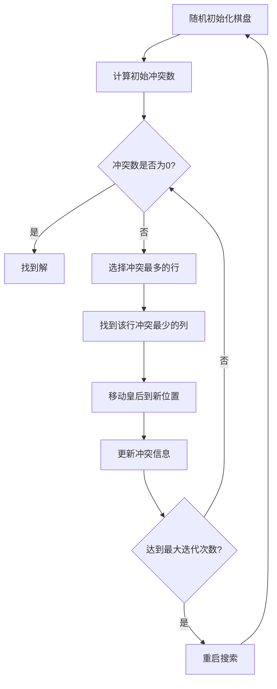
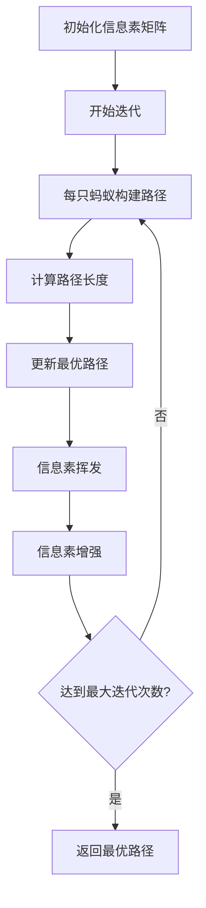
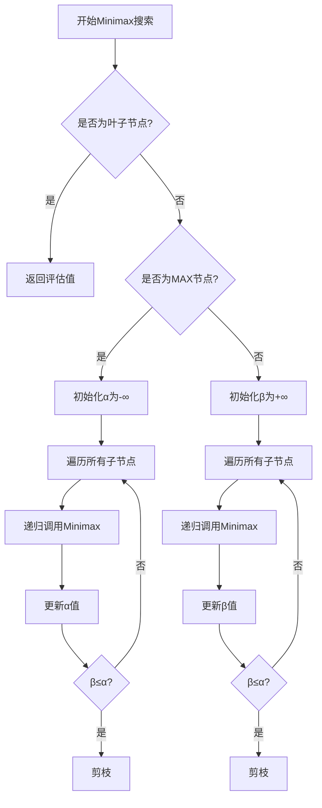
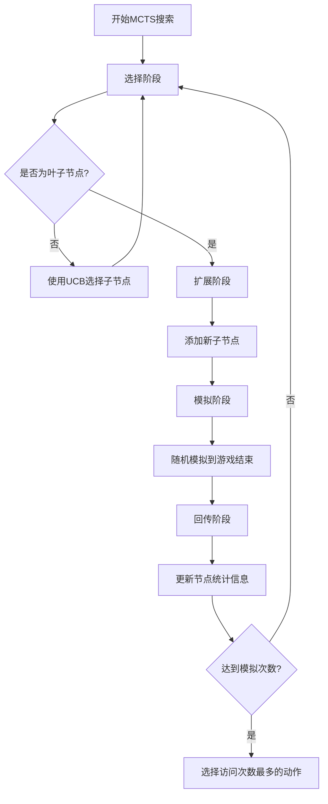
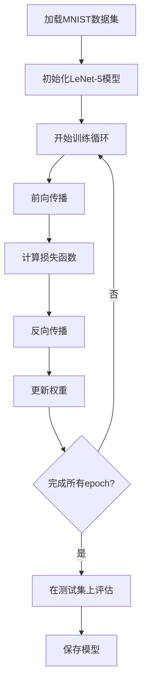

# 人工智能实验小结

## 实验概述

本实验包含八个经典的人工智能算法实现，涵盖了搜索算法、约束满足、博弈论、机器学习等多个AI核心领域。每个实验都通过具体的应用场景展示了不同算法的特点和适用性。

## 实验一：罗马尼亚度假问题 - 三种搜索算法对比

### 实验目标
分别采用代价一致宽度优先搜索(UCS)、贪婪算法和A*算法实现罗马尼亚度假问题，对比三种算法的性能差异。

### 算法实现
- **UCS (Uniform Cost Search)**: 基于代价的广度优先搜索，保证找到最优解
- **Greedy Best-First Search**: 基于启发式函数的贪婪搜索，快速但不保证最优
- **A* Search**: 结合UCS和贪婪算法的优点，使用f(n)=g(n)+h(n)评估函数

### 核心特点
- UCS: 时间复杂度O(b^(1+C*/ε))，保证最优解
- Greedy: 时间复杂度O(b^m)，快速但不保证最优
- A*: 时间复杂度O(b^d)，在启发式函数可采纳时保证最优解

## 实验二：N皇后问题 - 最小冲突法

### 实验目标
采用最小冲突法求解N皇后问题，要求N≥200，展示局部搜索算法在约束满足问题中的应用。

### 算法实现
- **最小冲突法**: 通过随机初始化，逐步减少冲突数量
- **冲突检测**: 高效的行、列、对角线冲突计算
- **重启机制**: 当陷入局部最优时重新开始搜索

### 核心特点
- 时间复杂度: O(n²) 每次迭代
- 空间复杂度: O(n)
- 适用于大规模约束满足问题

## 实验三：Wumpus怪兽世界 - 联机搜索算法

### 实验目标
使用联机搜索算法求解Wumpus怪兽世界问题，实现智能体的探索和决策。

### 算法实现
- **联机搜索**: 基于当前知识进行实时决策
- **知识表示**: 维护安全、危险、未知区域的知识库
- **路径规划**: 使用A*算法进行路径规划

### 核心特点
- 实时决策，无需完整环境信息
- 动态更新知识库
- 平衡探索与利用

## 实验四：罗马尼亚度假问题 - 蚁群算法

### 实验目标
利用蚁群算法(ACO)实现罗马尼亚度假问题，展示群体智能算法的应用。

### 算法实现
- **信息素更新**: τ(i,j) = (1-ρ)τ(i,j) + Δτ(i,j)
- **概率选择**: P(i,j) = [τ(i,j)]^α × [η(i,j)]^β / Σ[τ(i,k)]^α × [η(i,k)]^β
- **启发式信息**: η(i,j) = 1/d(i,j)

### 核心特点
- 参数α控制信息素重要性
- 参数β控制启发式信息重要性
- 参数ρ控制信息素挥发率

## 实验五：井字棋游戏 - α-β剪枝算法

### 实验目标
采用α-β剪枝算法实现井字棋游戏，随机选取先手后手，展示博弈树搜索的优化。

### 算法实现
- **Minimax算法**: 极大极小值搜索
- **α-β剪枝**: 剪除不必要的搜索分支
- **评估函数**: 基于游戏状态的启发式评估

### 核心特点
- 时间复杂度: O(b^(d/2)) (相比O(b^d)的完整搜索)
- 保证找到最优策略
- 适用于零和博弈

## 实验六：反转棋 - MCTS算法

### 实验目标
使用MCTS(Monte Carlo Tree Search)算法实现MiniAlphaGo for Reversi，结合神经网络进行决策。

### 算法实现
- **选择(Selection)**: 使用UCB公式选择节点
- **扩展(Expansion)**: 添加新子节点
- **模拟(Simulation)**: 随机模拟到游戏结束
- **回传(Backpropagation)**: 更新节点统计信息

### 核心特点
- 结合策略网络和价值网络
- 平衡探索与利用
- 适用于复杂博弈环境

## 实验七：Wumpus怪兽世界 - 强化学习

### 实验目标
使用强化学习(Q-learning)求解Wumpus怪兽世界问题，实现智能体的自主学习。

### 算法实现
- **Q-learning**: Q(s,a) = Q(s,a) + α[r + γmaxQ(s',a') - Q(s,a)]
- **ε-贪婪策略**: 平衡探索与利用
- **状态表示**: 位置、方向、感知信息等

### 核心特点
- 无模型学习
- 在线学习
- 适应动态环境

## 实验八：手写数字识别 - LeNet-5

### 实验目标
基于LeNet-5实现手写数字识别，展示深度学习在计算机视觉中的应用。

### 算法实现
- **LeNet-5架构**: 2个卷积层 + 2个池化层 + 3个全连接层
- **卷积神经网络**: 自动特征提取
- **反向传播**: 梯度下降优化

### 核心特点
- 自动特征学习
- 端到端训练
- 高识别准确率

## 算法流程图

### 1. A*搜索算法流程

```mermaid
flowchart TD
    A[初始化优先队列] --> B[将起始节点加入队列]
    B --> C{队列是否为空?}
    C -->|是| D[搜索失败]
    C -->|否| E[取出f(n)最小的节点]
    E --> F{是否为目标节点?}
    F -->|是| G[返回最优路径]
    F -->|否| H[标记为已访问]
    H --> I[扩展邻居节点]
    I --> J[计算f(n)=g(n)+h(n)]
    J --> K[将邻居加入优先队列]
    K --> C
```

### 2. 最小冲突法流程



### 3. 蚁群算法流程



### 4. α-β剪枝算法流程



### 5. MCTS算法流程



### 6. Q-learning算法流程

```mermaid
flowchart TD
    A[初始化Q表] --> B[观察当前状态s]
    B --> C[选择动作a(ε-贪婪)]
    C --> D[执行动作a]
    D --> E[获得奖励r和新状态s']
    E --> F[更新Q值]
    F --> G[状态转移s←s']
    G --> H{是否达到终止状态?}
    H -->|否| B
    H -->|是| I[开始新回合]
    I --> B
```

### 7. LeNet-5训练流程



## 实验总结

### 算法性能对比

| 实验 | 算法 | 时间复杂度 | 空间复杂度 | 最优性保证 |
|------|------|------------|------------|------------|
| 实验1 | UCS | O(b^(1+C*/ε)) | O(b^(1+C*/ε)) | 是 |
| 实验1 | Greedy | O(b^m) | O(b^m) | 否 |
| 实验1 | A* | O(b^d) | O(b^d) | 是(启发式可采纳) |
| 实验2 | 最小冲突 | O(n²) | O(n) | 否 |
| 实验3 | 联机搜索 | O(b^d) | O(b^d) | 否 |
| 实验4 | 蚁群算法 | O(m×n²×T) | O(n²) | 否 |
| 实验5 | α-β剪枝 | O(b^(d/2)) | O(d) | 是 |
| 实验6 | MCTS | O(n×T) | O(n) | 否 |
| 实验7 | Q-learning | O(|S|×|A|) | O(|S|×|A|) | 收敛到最优 |
| 实验8 | LeNet-5 | O(n×m) | O(n×m) | 局部最优 |

### 关键技术要点

1. **启发式搜索**: A*算法通过结合实际代价和启发式估计，在保证最优性的同时提高搜索效率。

2. **局部搜索**: 最小冲突法通过逐步减少冲突数量，有效解决大规模约束满足问题。

3. **联机决策**: 联机搜索算法在信息不完全的情况下进行实时决策，适用于动态环境。

4. **群体智能**: 蚁群算法通过信息素机制实现群体协作，在组合优化问题中表现优异。

5. **博弈搜索**: α-β剪枝通过剪除不必要的搜索分支，显著提高博弈树搜索效率。

6. **蒙特卡洛方法**: MCTS通过随机模拟和树搜索的结合，在复杂博弈中取得突破性进展。

7. **强化学习**: Q-learning通过试错学习，实现智能体在未知环境中的自主学习。

8. **深度学习**: LeNet-5通过卷积神经网络自动学习特征，在手写数字识别中取得优异效果。

### 实验收获

通过这八个实验，深入理解了人工智能的核心算法和思想：

- **搜索算法**的多样性和适用性
- **约束满足**问题的求解方法
- **博弈论**在AI中的应用
- **机器学习**的监督学习和强化学习范式
- **深度学习**在计算机视觉中的突破

这些实验为后续的AI研究和应用奠定了坚实的基础。 