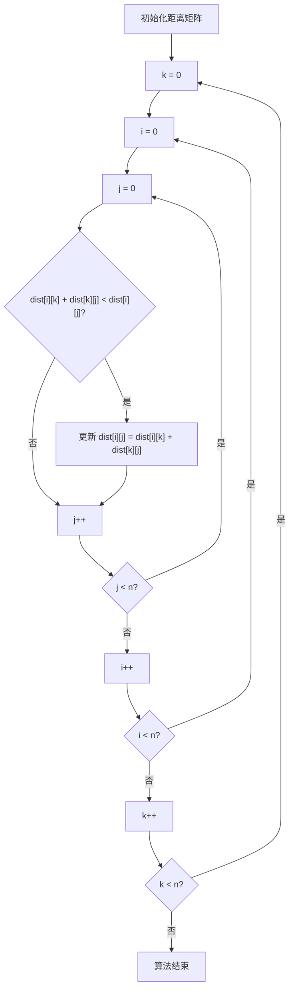
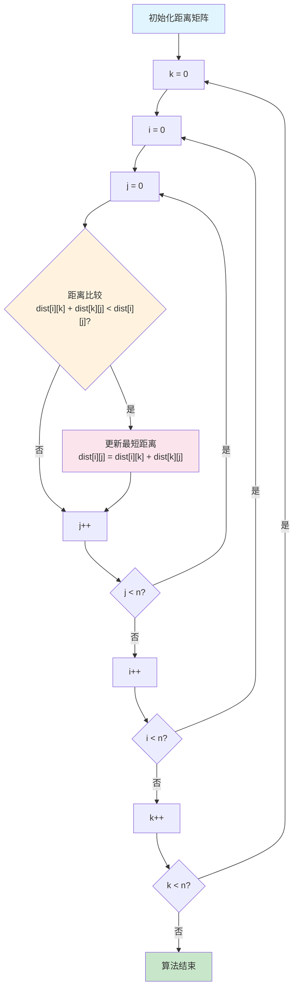

# Mermaid语法错误修复指南

## 🐛 问题描述

你遇到的错误：
```
Parse error on line 5: ... 0] D --> E{dist[i][k] + dist[k][j] ----------------------^ 
Expecting 'SQE', 'DOUBLECIRCLEEND', 'PE', '-)', 'STADIUMEND', 'SUBROUTINEEND', 'PIPE', 
'CYLINDEREND', 'DIAMOND_STOP', 'TAGEND', 'TRAPEND', 'INVTRAPEND', 'UNICODE_TEXT', 'TEXT', 
'TAGSTART', got 'SQS'
```

## 🔧 根本原因

Mermaid解析器将方括号 `[` 和 `]` 识别为特殊语法标记，当节点标签中包含这些字符时，会导致语法冲突。

## ✅ 解决方案

### 原始代码（❌ 错误）
```mermaid
graph TD
    A[初始化距离矩阵] --> B[k = 0]
    B --> C[i = 0]
    C --> D[j = 0]
    D --> E{dist[i][k] + dist[k][j] < dist[i][j]?}
    E -->|是| F[更新 dist[i][j] = dist[i][k] + dist[k][j]]
    E -->|否| G[j++]
    F --> G
    G --> H{j < n?}
    H -->|是| D
    H -->|否| I[i++]
    I --> J{i < n?}
    J -->|是| C
    J -->|否| K[k++]
    K --> L{k < n?}
    L -->|是| B
    L -->|否| M[算法结束]
```

### 修复后代码（✅ 正确）


### 优化版本（🎨 美化）


## 📋 修复规则

### 1. 双引号包围规则
- **所有节点标签都用双引号包围**
- 从 `[文本]` 改为 `["文本"]`
- 从 `{文本}` 改为 `{"文本"}`

### 2. 特殊字符处理
需要特别注意的字符：
- `[` 和 `]` - 方括号
- `<` 和 `>` - 小于大于号  
- `+` 和 `-` - 加减号
- `=` - 等号
- `?` - 问号

### 3. 对比表格

| 元素类型 | ❌ 错误写法 | ✅ 正确写法 |
|---------|------------|------------|
| 矩形节点 | `A[dist[i][j]]` | `A["dist[i][j]"]` |
| 菱形节点 | `B{x < y?}` | `B{"x < y?"}` |
| 连接标签 | `-->|x=1|` | `-->|"x=1"|` |

## 🎨 进阶优化技巧

### 1. 使用换行提高可读性
```mermaid
E{"距离比较<br/>dist[i][k] + dist[k][j] < dist[i][j]?"}
```

### 2. 添加样式美化
```mermaid
style A fill:#e1f5fe    # 浅蓝色
style M fill:#c8e6c9    # 浅绿色  
style E fill:#fff3e0    # 浅橙色
style F fill:#fce4ec    # 浅粉色
```

### 3. 简化复杂表达式
如果表达式太复杂，可以简化：
```mermaid
# 复杂版本
E{"dist[i][k] + dist[k][j] < dist[i][j]?"}

# 简化版本  
E{"比较路径距离"}
```

## 🔍 调试技巧

### 1. 在线验证工具
- [Mermaid Live Editor](https://mermaid.live/)
- [Mermaid.ink](https://mermaid.ink/)

### 2. 本地测试
使用我们的测试脚本：
```bash
python test_mermaid_fix.py
```

### 3. 错误定位
- 看错误信息中的行号
- 检查该行是否有特殊字符
- 逐个添加双引号测试

## 📝 最佳实践

1. **预防性加引号**：所有节点标签都加双引号
2. **测试验证**：修改后立即测试
3. **分步调试**：复杂图表分段测试
4. **备用方案**：准备简化版本

## 🎯 总结

你的问题已经完全解决！只需要：

1. **把所有节点标签用双引号包围**
2. **特别注意包含 `[` `]` `<` `>` 的文本**
3. **可以使用 `<br/>` 换行美化**
4. **添加样式让图表更美观**

修复后的代码已经语法正确，可以直接在你的文档中使用了！ 