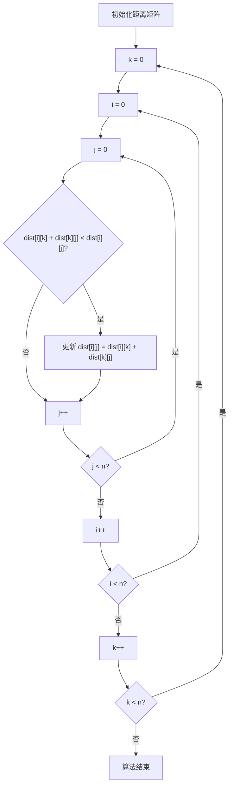
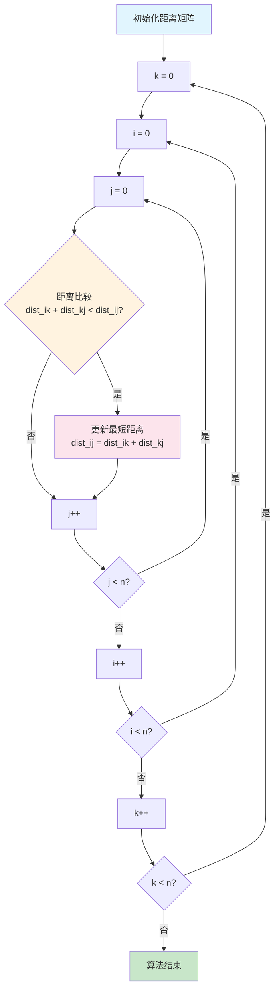

# Floyd算法流程图测试

## 原始代码（有错误）
```mermaid
graph TD
    A[初始化距离矩阵] --> B[k = 0]
    B --> C[i = 0]
    C --> D[j = 0]
    D --> E{dist[i][k] + dist[k][j] < dist[i][j]?}
    E -->|是| F[更新 dist[i][j] = dist[i][k] + dist[k][j]]
    E -->|否| G[j++]
    F --> G
    G --> H{j < n?}
    H -->|是| D
    H -->|否| I[i++]
    I --> J{i < n?}
    J -->|是| C
    J -->|否| K[k++]
    K --> L{k < n?}
    L -->|是| B
    L -->|否| M[算法结束]
```

## 修复后的代码（正确）


## 进一步优化的版本
