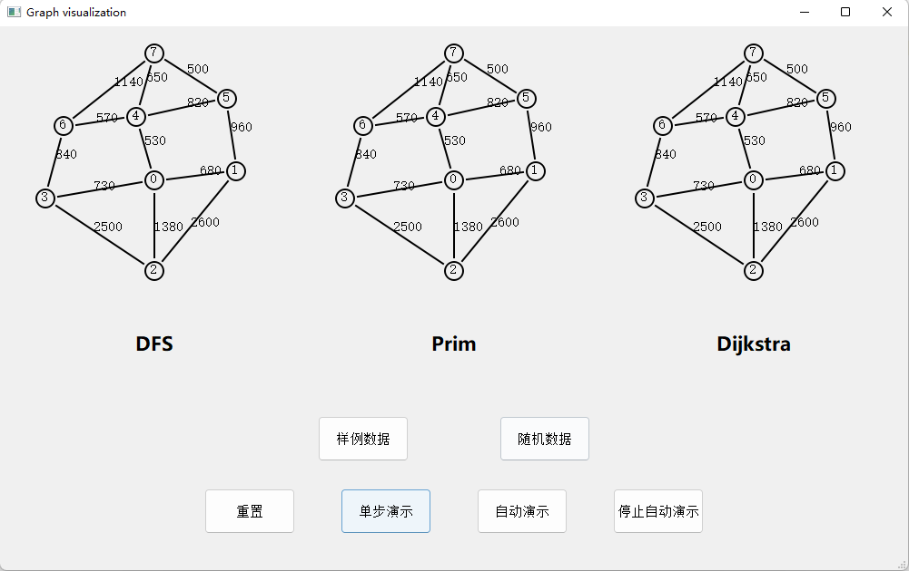
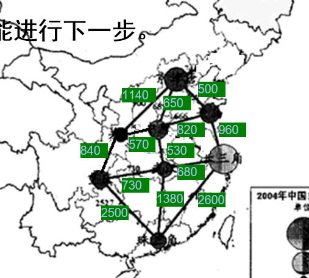
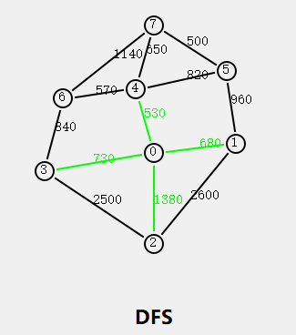
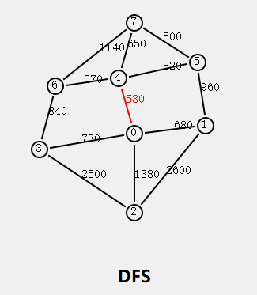
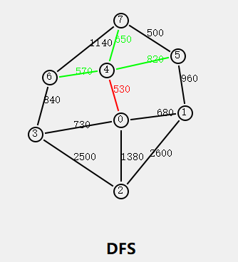
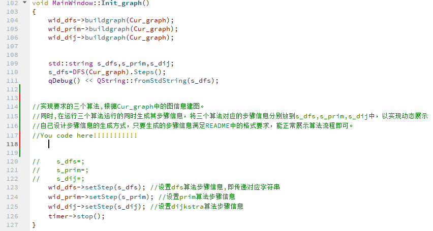

## Graph visualization

### Introduction

模板共包含两个部分：主窗口（mainwindow）、图可视化窗口(vis_widget)。

主窗口中包含各个按键以及分别用于显示三个算法的图可视化窗口。

图可视化窗口在导入**图信息**后，将显示信息所对应的图。导入**步骤信息**后，调用nextStep()逐步显示改变的图。



#### 图信息

在该模板中，图信息用一个字符串表示，且图均为无向图。

该字符串(string)内共包含$n+3m+1$个整数，分别用空格隔开，其中$n$表示图的节点个数，$m$表示图的边数。

字符串中第一个整数为$n$。

n个节点依次编号为$0,1,2…n-2,n-1$.

接下来的$3m$个整数，为m组边数据。每组边数据包含三个整数$S_i,T_i,dis_i$，分别表示该边的两个节点的编号$S_i,T_i$以及边权$dis_i$

E.X. 



PPT中所给的图对应的图信息字符串如下：

```
8 0 1 680 0 2 1380 0 3 730 0 4 530 1 2 2600 1 5 960 2 3 2500 3 6 840 4 5 820 4 6 570 4 7 650 5 7 500 6 7 1140
```

这也是代码中字符串`Sample_graph`中的内容，前文的图片所展示的就是由该数据构造出的图 。

为方便大家阅读并对照图理解该数据格式 ，可以写成如下形式：

```
8 
0 1 680 
0 2 1380 
0 3 730 
0 4 530 
1 2 2600 
1 5 960 
2 3 2500 
3 6 840 
4 5 820 
4 6 570 
4 7 650 
5 7 500 
6 7 1140
```

即前文所说的，n个节点，三个数为一组描述一条边。

#### 步骤信息

步骤信息同样是使用一个字符串表示。

vis_widget将通过该信息逐步改变边的颜色。

共包含k段数据，每段包含一个整数t，以及随后的t*3个整数。

每段数据表示t条边的颜色信息。每组边数据同样包含三个整数$S_i,T_i,Color_i$，表示将节点$S_i$和节点$T_i$ 之间的变为颜色$Color_i$。$Color_i=1,2,3$分别表示黑色、红色、绿色。

黑色为图的默认颜色。

这里我们给出一段对应ppt中图的步骤信息字符串：

```
4 0 4 3 0 3 3 0 2 3 0 1 3 5 0 4 1 0 3 1 0 2 1 0 1 1 0 4 2 3 4 7 3 4 6 3 4 5 3
```

同样可以写成如下格式：

```
4 
0 4 3 
0 3 3 
0 2 3 
0 1 3 
5 
0 4 1 
0 3 1 
0 2 1 
0 1 1 
0 4 2 
3 
4 7 3 
4 6 3 
4 5 3 

```
上述数据中对应3个步骤，即四组数据。每组数据对应的边数分别为4、5、3。

其对应的图逐步变化如下所示：







可以发现图将严格遵照数据改变，只改变数据中边的颜色，其余的边保持不变。

同时观察最后一组数据。我们先将边0-4先变为了黑色(1)，再变为了红色(2)，最后在图中也呈现红色。也即对于同一条边，将显示其最后一次修改的结果。


-----

### vis_widget

对应代码文件为`vis_widget.h`和`vis_widget.cpp`，用于可视化输入的图以及通过步骤演示信息逐步改变边的颜色，以实现可视化图论算法的过程。

`void buildgraph(std::string)`用于建图，其字符串即前文所规定的图信息。

`void setStep(std::string)`用于设置步骤信息，字符串同样为前文规定的步骤信息格式。

在该部分只设置了黑、红、绿三种边的颜色，可以分别用来表示普通边、选中的边、备选的边。大家可以根据自己的需要调整信息字符串格式，增加其他颜色。

--------

### mainwindow

共包含6个按钮和三个vis_widget窗口。

样例数据：将图调整为PPT中所给的样例数据。

随机数据：随机生成一个较为稀疏的图，该图保证无重边，无自环。

-----------------

### 关于模板使用

我们需要根据字符串Cur_graph中的图信息建图，实现要求的三个算法，根据注释将mainwindow.cpp中对应的代码修改。

修改位置如下图所示，只需将步骤信息分别放到s_dfs,s_prim,s_dij中即可。该模板只需修改这一处位置。



步骤信息的生成是在自己写的三个算法中实现的，注意要符合前文中的格式要求，否则无法正常动态演示。

