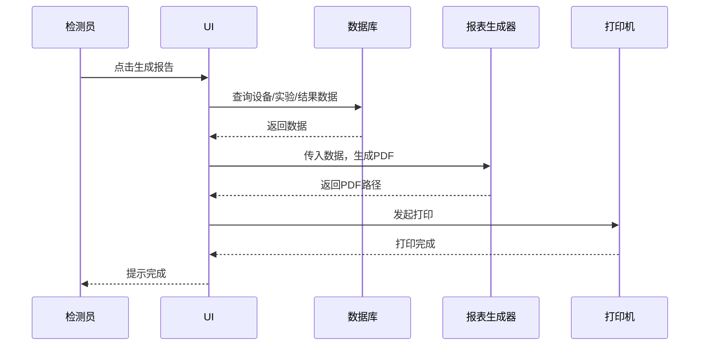
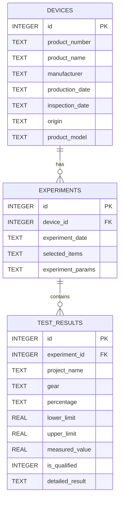
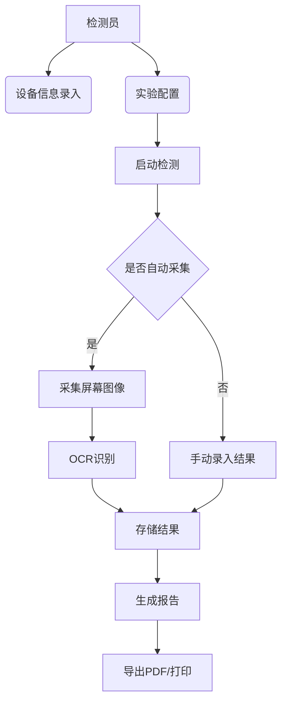
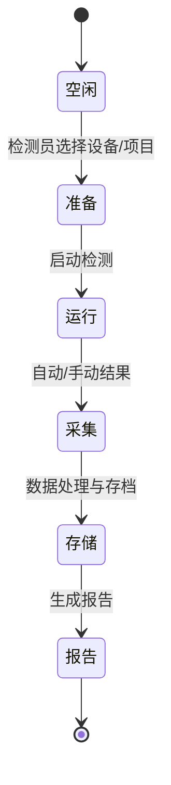
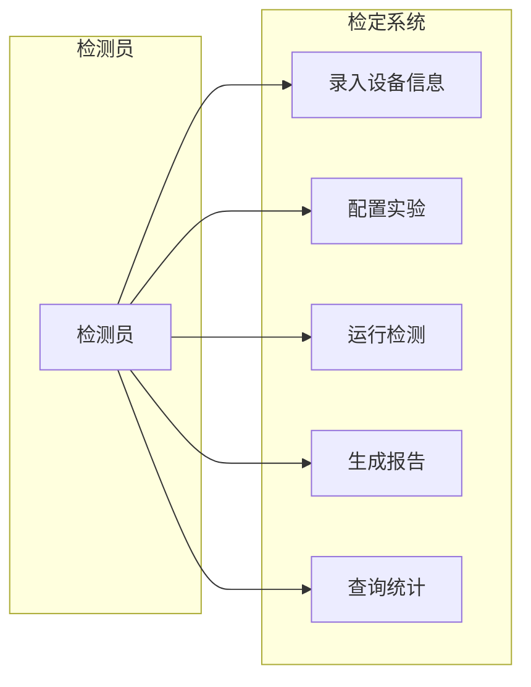
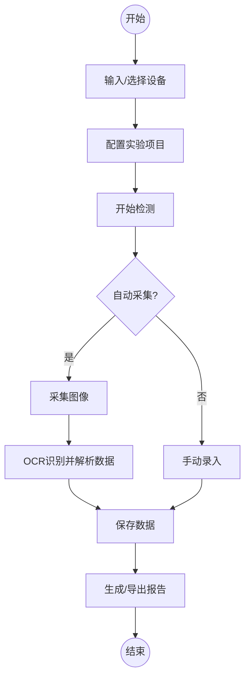
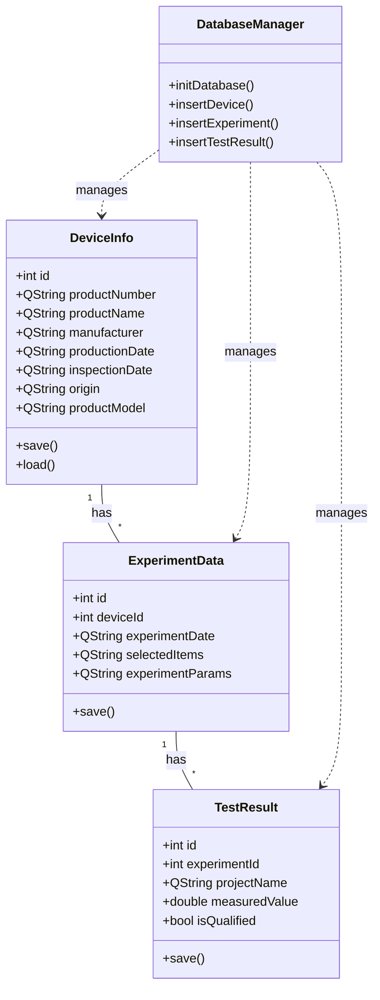
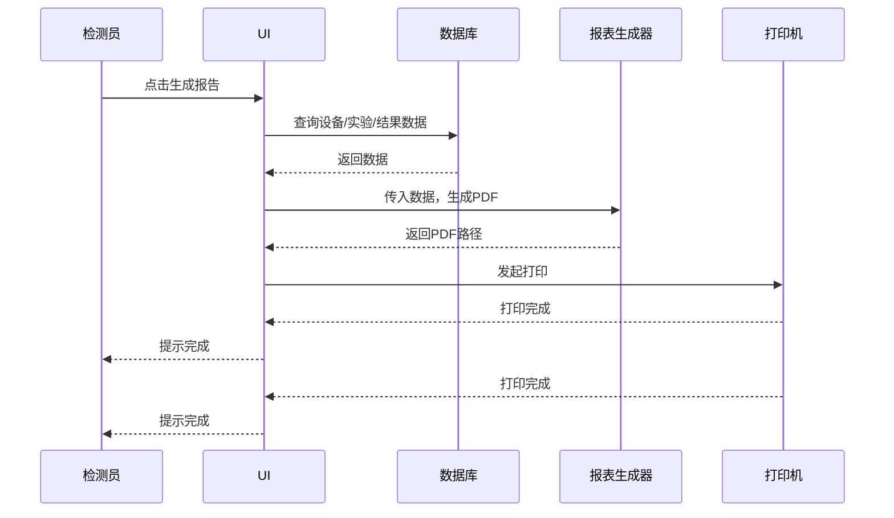

# 互感器二次压降检测仪检定系统课程设计报告

> 学校：
> 院系：

<!-- 说明：此 Markdown 文件为课程设计报告草稿，包含结构化分析、面向对象设计视图、实验报告模板、图表占位和转换为 Word 的样式映射说明。你可以在本文件中替换占位图片/数据为你的 sigma 输出图或代码生成的图片。 -->

## 目录

- [第1章 引言](#第1章-引言)
- [第2章 需求分析](#第2章-需求分析)
  - [2.1 背景与意义](#21-背景与意义)
  - [2.2 功能需求](#22-功能需求)
  - [2.3 非功能需求](#23-非功能需求)
- [第3章 结构化分析与设计](#第3章-结构化分析与设计)
  - [3.1 数据模型（ER）](#31-数据模型er)
  - [3.2 功能模型（DFD/用例概述）](#32-功能模型dfd用例概述)
  - [3.3 行为模型（状态/活动图）](#33-行为模型状态活动图)
- [第4章 面向对象分析与设计（四视图）](#第4章-面向对象分析与设计四视图)
  - [4.1 用例图](#41-用例图)
  - [4.2 活动图（检测流程）](#42-活动图检测流程)
  - [4.3 类图](#43-类图)
  - [4.4 打印检测报告时序图](#44-打印检测报告时序图)
- [第5章 实验实现与检测报告示例](#第5章-实验实现与检测报告示例)
  - [5.1 系统环境与运行说明](#51-系统环境与运行说明)
  - [5.2 设备信息输入示例（表）](#52-设备信息输入示例表)
  - [5.3 实验配置示例（表）](#53-实验配置示例表)
  - [5.4 检测结果采集与识别示例（表与图）](#54-检测结果采集与识别示例表与图)
  - [5.5 报告输出示例（PDF/打印）]
- [第6章 测试与验证](#第6章-测试与验证)
- [第7章 总结与展望](#第7章-总结与展望)
- [参考文献](#参考文献)

---

## 第1章 引言

1.1 项目背景


下方为 `mermaid` 源码（用于再生成图像）：



(（导出为图作为“图4-4 打印报告时序图”）)
## 第3章 结构化分析与设计

### 3.1 数据模型(ER)

图3-1 数据模型（ER）示意：



下方为 `mermaid` 源码（用于再生成图像）：


> 注：如需生成图片，可将上述 mermaid 在支持 mermaid 的编辑器中导出为 PNG，用于报告中作为“图3-1”。

### 3.2 功能模型（DFD /用例概述）





下方为 `mermaid` 源码（用于再生成图像）：


### 3.3 行为模型（状态/活动图）

- 检测流程状态图（部分）示例：




下方为 `mermaid` 源码（用于再生成图像）：


## 第4章 面向对象分析与设计（四视图）

说明：以下视图均以面向对象方法描述系统的主要类与交互。

### 4.1 用例图

用例说明：检测员可以执行“录入设备信息”、“配置实验”、“运行检测（采集）”、“生成/打印报告”、“查询历史记录”。


下方为 `mermaid` 源码（用于再生成图像）：


```

（将该 mermaid 导出为图作为“图4-1 用例图”）

### 4.2 活动图（检测流程）


下方为 `mermaid` 源码（用于再生成图像）：


```

### 4.3 类图

下面是核心类的一个简化类图：


下方为 `mermaid` 源码（用于再生成图像）：


```

### 4.4 打印检测报告的时序图

以下为“检测报告生成与打印”的简化时序图：


下方为 `mermaid` 源码（用于再生成图像）：




（导出为图作为“图4-4 打印报告时序图”）

---

## 第5章 实验实现与检测报告示例

### 5.1 系统环境与运行说明

- 开发：Qt 6 / C++ (项目在 `SEwork.pro` 中)
- 数据库：SQLite（数据库文件位于应用数据目录，文件名 `transformer_inspection.db`）
- 可选：Tesseract OCR（若需要自动图像识别）

运行：在 Qt Creator 中打开 `SEwork.pro`，构建并运行；主界面提供多标签页用于设备信息、实验配置、结果录入与查询。

### 5.2 设备信息输入示例（表）

表5-1 设备信息示例

| 字段 | 值 |
|---:|---|
| 产品编号 | 20231234 |
| 产品名称 | 互感器二次压降检测仪 |
| 制造商 | ABC 仪器有限公司 |
| 生产日期 | 2023-08-01 |
| 送检日期 | 2023-10-02 |
| 产地 | 中国 |
| 产品型号 | XJ-PT100 |

> 注：在 Word 中本表说明应置于表上方并编号为“表5-1 设备信息示例”。

### 5.3 实验配置示例（表）

表5-2 实验配置示例（参考图片1）

| 项目 | 档位 | 百分比 | 数据下限 | 数据上限 | 实测数据 |
|---|---:|---:|---:|---:|---:|
| PT1 | 100V | 20% | 19.6% | 20.4% | 20% |
| PT2 | 100V | 100% | 98.0% | 102.0% | 100% |
| CT1 | 5A   | 5%   | 4.90% | 5.1%   | 4.99% |
| CT2 | 5A   | 100% | 98.0% | 102.0% | 99% |

### 5.4 检测结果采集与识别示例（表与图）

图5-1 检测结果采集（仪器屏幕截图或 OCR 识别示例）


表5-3 OCR 解析并规范化后的结果示例（参考图片2）

| 指标 | ao | bo | co |
|---:|---:|---:|---:|
| f(%) | 0.0399 | 0.1332 | 0.7345 |
| d(分) | -0.407 | -0.886 | -0.408 |
| dU(%) | 0.5268 | 0.5650 | 0.5401 |
| Upt:U | 12.575 | 26.550 | 51.328 |
| Uyb:U | 33.575 | 81.269 | 90.226 |

表5-4 最终测量结果摘要

| 测量项 | 结果 |
|---|---:|
| 二次电压 | 14.8 U |
| tanφ | -31.2336 |
| 测量点编号 | 86678765 |
| 温度 | 21.9 ℃ |
| 湿度 | 34.6 % |

报告示例生成后的页面截图或 PDF 可放置为“图5-2 报告 PDF 预览”。

### 5.5 报告输出示例（PDF/打印）

- 报告包含：封面（按院校模板）、目录、设备信息、实验配置、检测结果（含图像）、结论与签字页。
- 建议导出 PDF 时首页不计页码，从目录页开始计页并连续编号。

---

## 第6章 测试与验证

- 单元测试：对 `DatabaseManager` 的插入/查询/删除方法做单元测试（可用 QtTest 或手动测试）。
- 功能测试：模拟录入一台设备、配置一组实验、录入测量结果并生成报告，验证数据库记录完整性和报告内容一致性。
- OCR 验证：若启用 Tesseract OCR，应对若干屏幕截图进行识别率测试，并记录识别错误类型与预处理方法（如二值化、去噪）。

---

## 第7章 总结与展望

7.1 结论与体会

本系统实现了互感器二次压降检定工作的信息化管理：实现设备信息录入、实验配置、结果采集与存储、报告生成与查询统计，显著提升了检定效率与数据可追溯性。

7.2 存在的问题与将来工作

- OCR 识别受屏幕分辨率、字体影响；需改进图像预处理与识别后校对机制；
- 可增加权限管理、审计日志以满足检定管理要求；
- 可集成更丰富的统计分析与可视化（例如趋势图、箱线图）；
- 可对接设备通讯接口，实现更深层次的自动化采集。

---

## 参考文献

[1] 王某某, 《电力互感器检测技术》, 电力出版社, 2018.

[2] Tesseract OCR, https://github.com/tesseract-ocr/tesseract

[3] Qt Documentation, https://doc.qt.io/

---

## 附录：将 Markdown 转换为 Word 的样式与排版建议

- 建议使用 `pandoc` 将 Markdown 转为 DOCX，然后在 Word 中调整样式，或使用 Typora/MarkText 直接导出 DOCX。

示例命令（在 Windows PowerShell 中可用）：

```powershell
pandoc report.md -o report.docx --reference-doc=word-reference.docx
```

说明：`word-reference.docx` 为一个 Word 模板文件，用来映射样式（推荐你先在 Word 中创建一个模板 `word-reference.docx`，设置如下样式）：

- `Heading 1` -> 章标题：2号宋体（居中），上下间距按学校要求（占6行）
- `Heading 2` -> 小节标题（1.1）: 3号黑体（居中）
- `Heading 3` -> 第三层小节: 4号黑体（居左）
- `Normal` -> 正文: 5号宋体（中文）/ 5号 Times New Roman（英文）
- 图注样式：小5号，居中；表注样式：小5号，居中且位于表上方

如何制作 `word-reference.docx`：
1. 在 Word 新建空白文档；
2. 修改各级标题样式（右键样式->修改），调整字体、大小、对齐和段前段后距离；
3. 保存为 `word-reference.docx`，并在 `pandoc` 导出时通过 `--reference-doc` 指定。

图表导出与编号：
- 将 mermaid 图另存为 PNG/JPG，放入 `images/` 文件夹；在 Markdown 中按章节插入，例如 ``；导出为 Word 时图片会被嵌入；
- 在 Word 中手动添加图注并按“图5-1”格式编号（或者使用 Word 的引用->插入题注功能自动编号）。

页码设置：
- 在 Word 中从目录页之后设置页码起始为 1（插入分节符并设置分节的页码格式）。

---

## 使用说明与下一步

- 我已在该报告中加入 mermaid 源码作为占位图；请用你的 sigma 输出或项目中的截图替换 `images/` 下的占位图片，并根据实际代码/运行结果填充表格中的具体数值；
- 如果你需要，我可以：
  - 将 mermaid 导出为 PNG 并把图片添加到仓库；
  - 根据 `SEwork` 项目中具体代码片段生成更精确的类图/序列图；
  - 生成 `word-reference.docx` 示例模板以直接使用 `pandoc` 导出。


---

*生成于 2025-12-09*