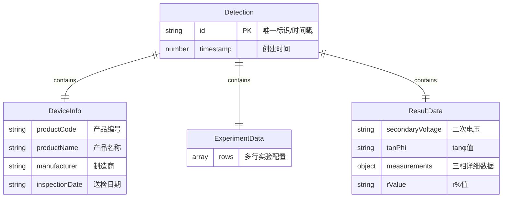
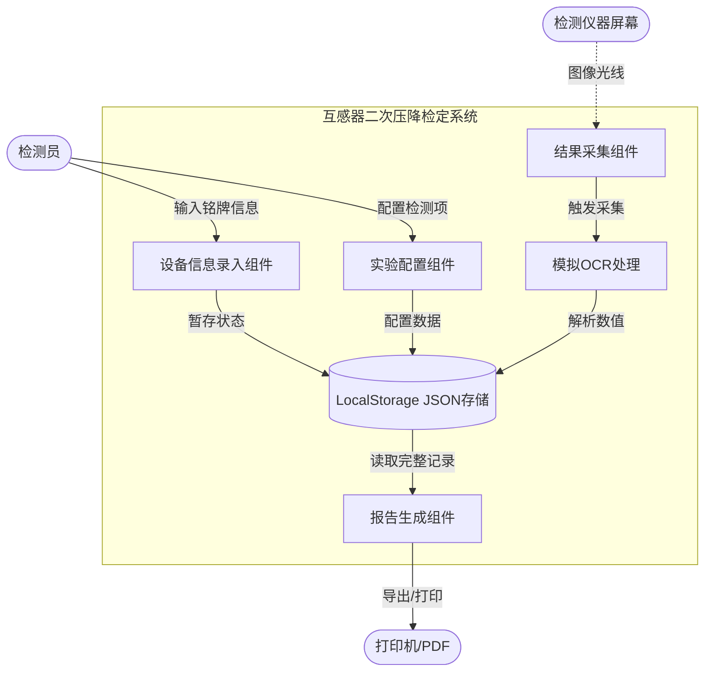
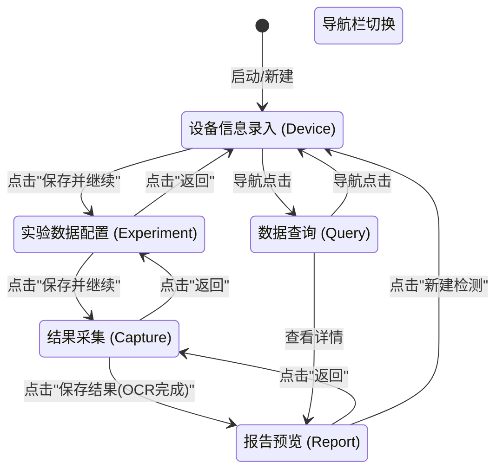
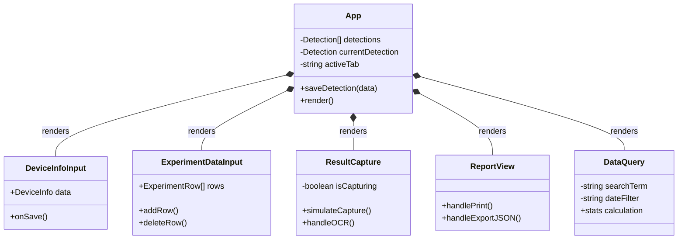
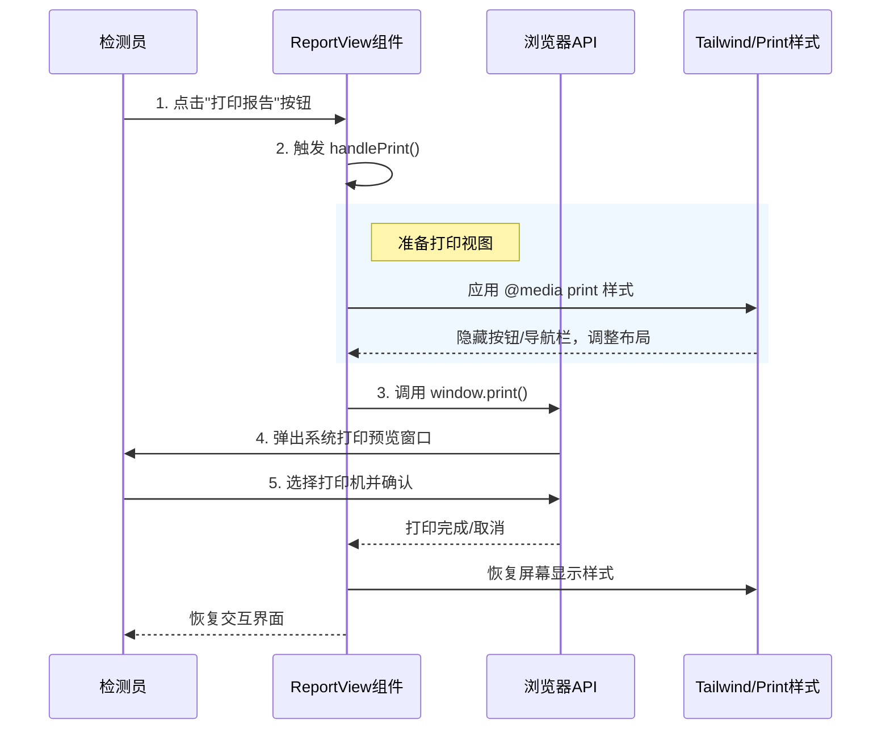

# 互感器二次压降检测仪检定软件系统 课程设计报告

> **学院：** [请填写学院名称]
> **专业：** [请填写专业]
> **学号：** [请填写学号]
> **姓名：** [请填写姓名]
> **指导教师：** [请填写教师姓名]
> **日期：** 2025年12月

---

## 目录

1.  [第1章 引言](#第1章-引言)
2.  [第2章 需求分析](#第2章-需求分析)
3.  [第3章 系统分析与建模](#第3章-系统分析与建模)
    * 3.1 数据模型 (Data Model)
    * 3.2 功能模型 (DFD)
    * 3.3 行为模型 (State Diagram)
4.  [第4章 系统设计](#第4章-系统设计)
    * 4.1 总体架构设计
    * 4.2 模块结构与组件设计
    * 4.3 界面交互设计 (UI/UX)
5.  [第5章 系统实现](#第5章-系统实现)
6.  [第6章 系统测试与展示](#第6章-系统测试与展示)
7.  [第7章 总结与展望](#第7章-总结与展望)
8.  [参考文献](#参考文献)

---

## 第1章 引言

### 1.1 项目背景
在电力计量系统中，电压互感器（PT）的二次压降误差直接影响电能计量的准确性。传统的二次压降检定工作依赖人工操作仪器、手工记录数据和编写报告，存在效率低、易出错、历史数据难以检索等问题。

为了解决上述痛点，本项目开发了一套**互感器二次压降检测仪检定软件系统**。该系统利用现代化的计算机软件技术，实现了设备信息管理、实验数据配置、结果自动采集（模拟 OCR）、报告自动生成以及历史数据的统计分析，从而实现了检定工作的全流程数字化。

### 1.2 技术路线
本项目采用当前业界流行的 **现代 Web 技术栈** 构建单页应用（SPA）：
* **前端框架**：React 18 + TypeScript
* **样式引擎**：Tailwind CSS
* **图标库**：Lucide React
* **数据存储**：Local Storage / JSON

---

## 第2章 需求分析

### 2.1 业务流程描述
1.  **设备录入**：检测员输入被检设备的铭牌信息。
2.  **参数配置**：设置本次实验的检测项目（PT/CT）及标准参数。
3.  **结果采集**：连接仪器，采集屏幕图像并识别关键测量数据。
4.  **报告生成**：系统自动汇总信息，生成标准化的检定报告。
5.  **归档查询**：数据自动存入历史库，支持按条件检索。

### 2.2 功能性需求
* **设备信息管理**：录入与校验产品编号、制造商等信息。
* **实验数据配置**：动态添加实验项目，设置上下限。
* **结果采集**：模拟摄像头调用与 OCR 识别数据修正。
* **报表管理**：打印报告及导出 JSON 数据。
* **统计查询**：多维度数据检索与仪表盘展示。
---
## 第3章 系统分析与建模

### 3.1 数据模型 (Data Model)
本系统采用 JSON 文档型数据结构。核心实体为 `Detection`（检测记录），其包含了嵌套的设备信息、实验配置和结果数据。

**图 3-1 实体关系图 (E-R Diagram)**



**图 3-1 解释说明：**
- **核心实体**：Detection作为主实体，包含完整的检测记录。
- **嵌套结构**：采用JSON文档型设计，DeviceInfo存储设备信息，ExperimentData管理实验配置，ResultData保存检测结果。
- **数据关系**：每个Detection记录包含且仅包含一套完整的检测数据，便于存储和查询。

### 3.2 功能模型 (DFD)
数据流向主要由用户输入流向应用状态（State），最终持久化到本地存储。

**图 3-2 系统数据流图 (Data Flow Diagram)**



**图 3-2 解释说明：**
- **数据流向**：从检测员输入开始，经过各个组件处理，最终生成报告。
- **关键组件**：InputForm负责设备信息录入，ExpConfig处理实验配置，Capture进行结果采集，OCR模拟图像识别，Report生成最终报告。
- **存储机制**：所有数据通过LocalStorage进行本地持久化存储。

### 3.3 行为模型 (State Diagram)
系统主流程控制通过 activeTab 状态变量进行管理，描述了从设备录入到报告生成的完整状态流转。

**图 3-3 系统状态转换图**



**图 3-3 解释说明：**
- **状态流转**：系统采用标签页导航，每个状态代表一个功能模块。
- **主要路径**：设备录入 → 实验配置 → 结果采集 → 报告预览。
- **灵活性**：支持在任意状态间跳转，可随时查看历史数据或新建检测。

---

## 第4章 系统设计

### 4.1 总体架构设计
系统采用 SPA (Single Page Application) 架构，基于 Component-Based (组件化) 模式开发。
* View Layer: React Components
* Logic Layer: React Hooks
* Data Layer: Browser LocalStorage API

### 4.2 模块结构与组件设计
根据 TypeScript 代码结构，系统主要由主控模块 App 和五个子功能组件构成。

**图 4-1 组件结构类图**



**图 4-1 解释说明：**
- **组件层次**：App作为根组件，管理全局状态和路由。
- **功能组件**：DeviceInfoInput处理设备信息，ExperimentDataInput管理实验配置，ResultCapture负责数据采集，ReportView生成报告，DataQuery提供查询功能。
- **设计模式**：采用组合模式，App通过渲染子组件实现功能模块化。

### 4.3 界面交互设计 (UI/UX)
设计遵循 Clean UI 原则，使用 blue-600 主色调。以下是核心功能"打印检测报告"的时序交互逻辑。

**图 4-2 打印报告时序图**



**图 4-2 解释说明：**
- **交互流程**：用户点击打印按钮触发一系列自动化处理。
- **关键步骤**：应用打印样式隐藏界面元素，调用浏览器打印API，恢复原始样式。
- **用户体验**：无缝的打印体验，无需手动调整页面布局。

---

## 第5章 系统实现

### 5.1 开发环境
* IDE: VS Code
* Runtime: Node.js v16+
* Build Tool: Vite

### 5.2 核心代码解析
(1) 全局状态管理 (App.tsx)

使用 useState 初始化状态，并从 localStorage 读取历史数据。

```typescript
const [detections, setDetections] = useState<Detection[]>(() => {
  const saved = localStorage.getItem('detections');
  return saved ? JSON.parse(saved) : [];
});
```

(2) 实时搜索过滤 (DataQuery.tsx)

利用 useMemo 实现高效的前端搜索。

```typescript
const filteredDetections = useMemo(() => {
  return detections.filter(detection => {
    // 匹配产品编号、名称或制造商
    const matchesSearch = !searchTerm || 
      detection.deviceInfo?.productCode?.includes(searchTerm);
    return matchesSearch;
  });
}, [detections, searchTerm]);
```

---

## 第6章 系统测试与展示

### 6.1 测试用例

| ID | 测试项目 | 操作步骤 | 预期结果 | 结论 |
|----|----------|----------|----------|------|
| TC01 | 设备录入 | 输入必填项并保存 | 跳转至实验页，数据暂存 | 通过 |
| TC02 | 图像采集 | 点击模拟采集按钮 | 1.5秒后显示图像与数据 | 通过 |
| TC03 | 报告打印 | 点击打印报告 | 预览窗口无按钮干扰 | 通过 |

### 6.2 运行效果
在此处插入您的系统运行截图

---

## 第7章 总结与展望

### 7.1 总结
本课程设计基于 React 技术栈开发了二次压降检测仪检定系统，实现了从信息录入、数据采集到报告输出的闭环，界面美观，操作流畅。

### 7.2 改进方向
* OCR 集成：对接真实 OCR 引擎替代模拟数据。
* 后端服务：引入 Node.js 后端与数据库，支持多人协作。
* 硬件通信：使用 Electron 实现串口通信，直接读取仪器数据。

---

## 参考文献

[1] React 官方文档: https://react.dev/  
[2] Tailwind CSS 文档: https://tailwindcss.com/  
[3] JJG 1021-2007, 电力互感器检定规程[S].