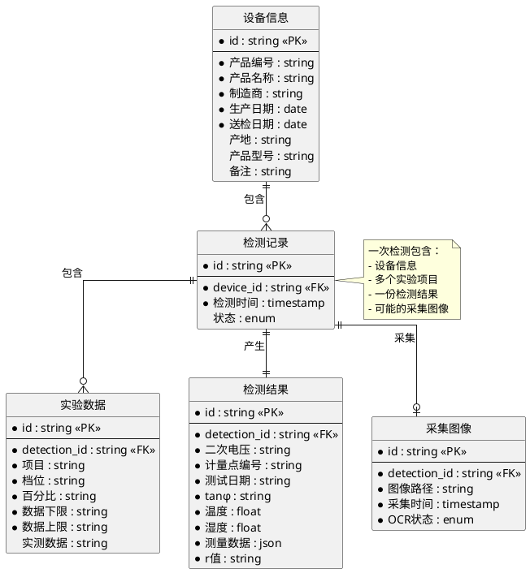
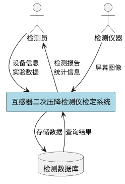
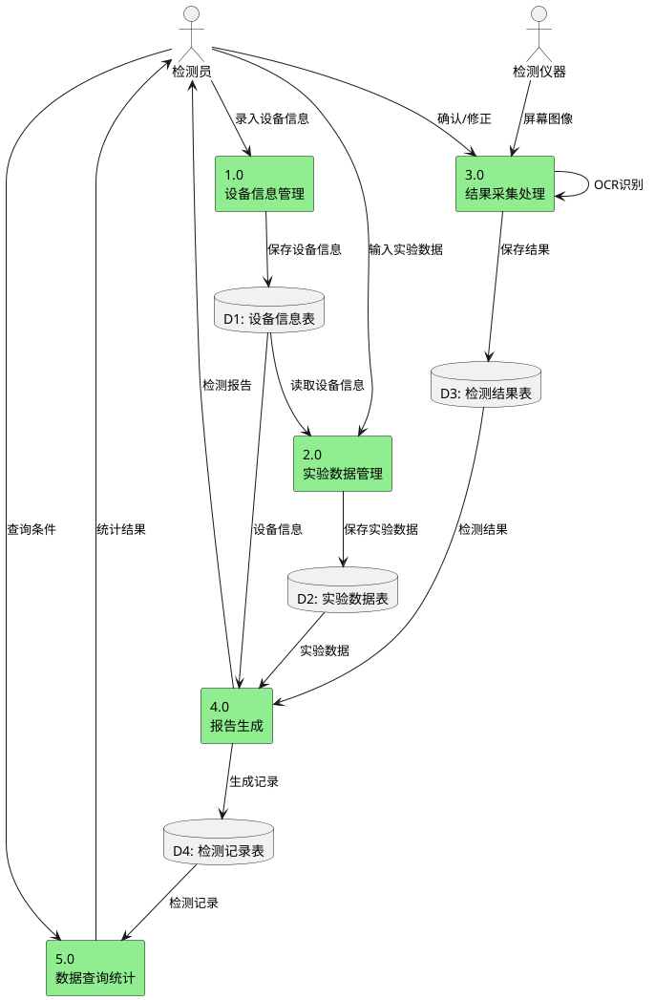
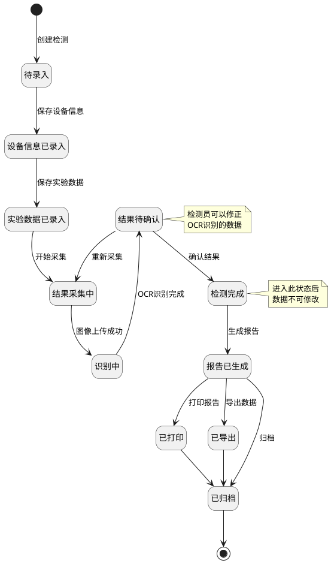
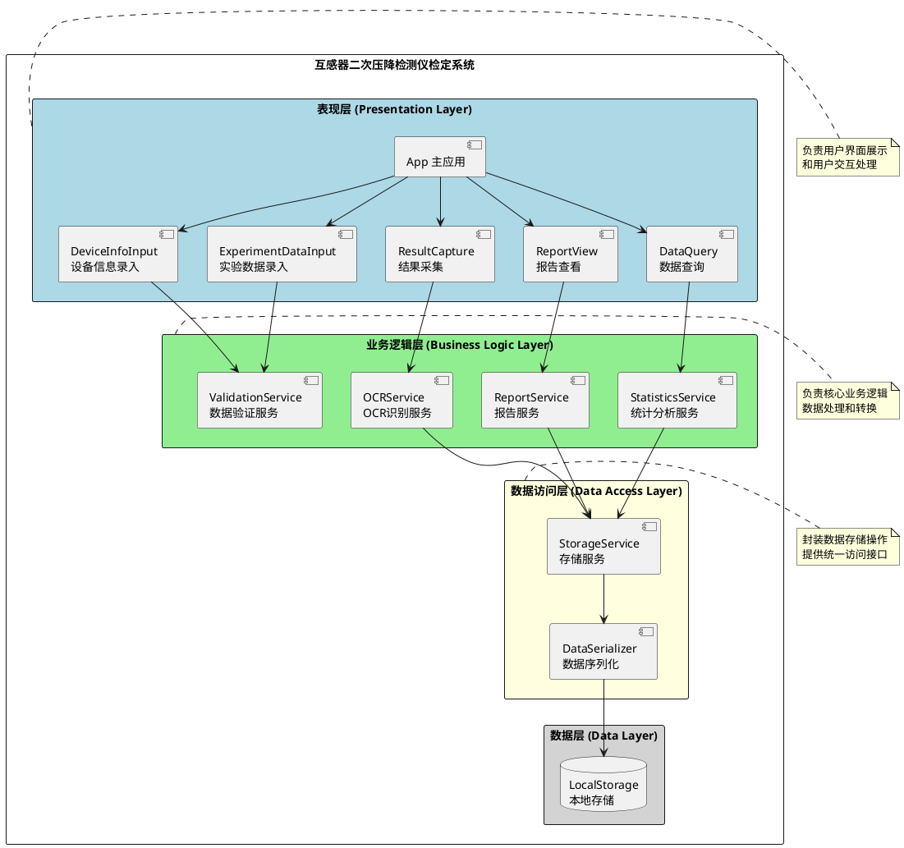
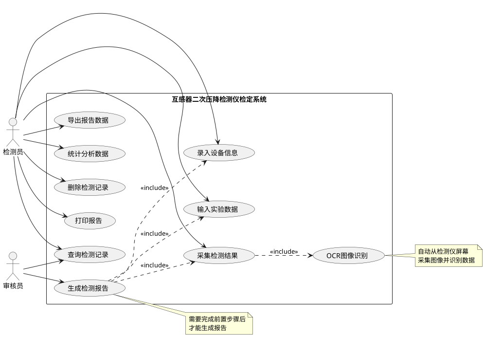
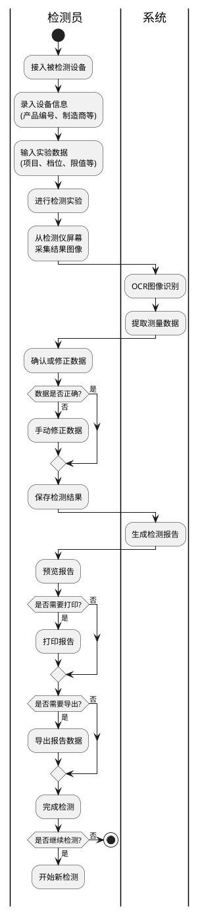
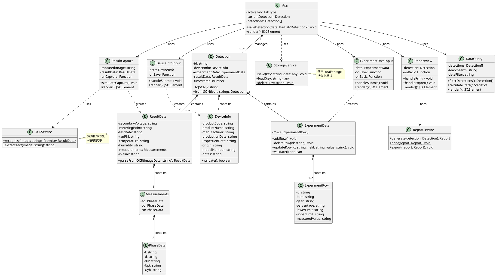
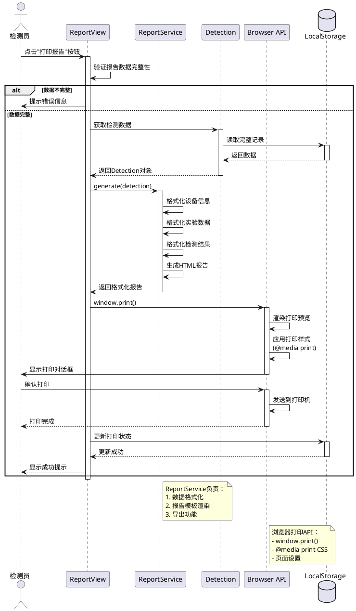

# 目录

1. [第1章 引言](#第1章-引言)
2. [第2章 需求分析](#第2章-需求分析)
3. [第3章 结构化分析与设计](#第3章-结构化分析与设计)
4. [第4章 面向对象分析与设计](#第4章-面向对象分析与设计)
5. [第5章 用户界面设计](#第5章-用户界面设计)
6. [第6章 总结](#第6章-总结)

---

# 第1章 引言

## 1.1 背景意义

在电力计量领域，互感器的二次压降误差直接影响电能计量的准确性。传统的二次压降检定工作长期依赖人工操作，检测员需要手动记录检测仪器的读数，并人工计算误差，最后编写纸质报告。这种方式存在诸多弊端：首先，人工抄录数据效率低下且容易出现笔误；其次，纸质报告难以长期保存和快速检索；最后，缺乏有效的数据统计手段，难以对设备质量进行长期跟踪。

为了解决上述问题，开发一套“二次压降检测仪检定软件系统”具有重要的现实意义。该系统旨在通过计算机技术与检测仪器的结合，实现实验结果的自动采集（屏幕图像识别）、数据自动存储、报告自动生成以及信息的数字化管理，从而显著提升设备检定工作的工作效率与质量，确保电能计量的公正性。

## 1.2 软件需求描述

本软件系统主要服务于互感器检定实验室，核心需求如下：

*   **灵活的数据输入**：检测员能够方便地录入被检设备的基本信息（如产品编号、制造商、生产日期等）以及实验参数（如检测项目、档位、限值等）。
*   **自动化的结果采集**：系统需支持连接摄像头或直接读取设备屏幕图像，利用 OCR 技术自动识别仪器屏幕上的测量数据（如二次电压、角差、比差），减少人工干预。
*   **数据存储与管理**：所有实验数据需持久化存储在计算机中，支持对历史记录的查询、修改（仅限特定状态）和删除。
*   **智能报告生成**：系统应能根据录入的设备信息和采集的实验数据，自动生成符合规范的检测报告，并支持预览、打印和导出功能。
*   **统计分析**：提供基础的数据统计功能，如按时间段或制造商统计检测数量。

---

# 第2章 需求分析

## 2.1 整体关系框架

本系统的分析与设计遵循软件工程的标准流程，分为需求分析阶段和设计阶段。整体关系框架如图 2-1 所示。

**图 2-1 系统分析与设计整体框架**

*   **需求分析阶段**：通过用例图描述系统功能和参与者，通过活动图描述业务流程。
*   **设计阶段**：
    *   **结构化设计**：包含数据模型（ER图）、功能模型（数据流图）和行为模型（状态图）。
    *   **面向对象设计**：包含类图（静态结构）和时序图（动态交互）。

(注：此处为文字描述，具体图表见后续章节)

---

# 第3章 结构化分析与设计

本章采用结构化分析方法，从数据、功能和行为三个维度对系统进行建模。

## 3.1 数据模型 (E-R图)

数据模型用于描述系统中的实体及其相互关系。本系统主要包含设备信息、检测记录、实验数据、检测结果和采集图像五个核心实体。

**图 3-1 系统数据模型 (E-R图)**

## 3.2 功能模型 (数据流图 DFD)

数据流图展示了数据在系统各模块间的流动过程。

**图 3-2 系统 0 层数据流图**

**图 3-3 系统 1 层数据流图**

## 3.3 行为模型 (状态图)

状态图描述了检测记录从创建到归档的全生命周期状态变化，明确了不同阶段的操作权限。

**图 3-4 检测记录状态转换图**

## 3.4 模块结构图

模块结构图展示了系统的软件架构分层，明确了表现层、业务逻辑层、数据访问层和数据层的职责。

**图 3-5 系统模块结构图**

---

# 第4章 面向对象分析与设计

本章采用面向对象方法，通过用例图、活动图、类图和时序图对系统进行详细设计。

## 4.1 用例图

用例图明确了系统的参与者（检测员、审核员）及其可执行的功能操作。

**图 4-1 系统用例图**

## 4.2 活动图

活动图描述了检测员从设备接入到最终完成报告打印的完整业务流程，包括了数据校验和修正的决策逻辑。

**图 4-2 检定业务流程活动图**

## 4.3 类图

类图展示了系统的静态结构，包括实体类（如 Detection, DeviceInfo）、边界类（如 DeviceInfoInput, ReportView）和控制/服务类（如 StorageService, OCRService）。

**图 4-3 系统类图**

## 4.4 打印检测报告的时序图

时序图详细描述了“打印检测报告”这一核心功能的动态调用过程，展示了视图层、服务层、领域对象和底层 API 之间的交互。

**图 4-4 打印检测报告时序图**

---

# 第5章 用户界面设计

(注：此处应插入您之前提到的 UI 设计截图或 Figma 导出图，并附上简单的界面说明)

## 5.1 界面设计原则

本系统界面设计遵循“简洁、高效、清晰”的原则，采用蓝白为主色调，符合工业软件的专业感。操作流程采用向导式设计，引导用户分步完成检测。

---

# 第6章 总结

本文设计并实现了一套二次压降检测仪检定软件系统。通过结构化分析和面向对象设计方法，明确了系统的需求和架构。系统实现了从设备信息录入、图像采集识别到报告生成的全流程自动化，解决了传统人工检定效率低、易出错的问题。通过引入 OCR 技术和数字化存储，极大地提升了检定工作的智能化水平。未来工作将集中在进一步提高 OCR 识别在复杂光线下的准确率，以及开发移动端应用以支持远程数据查询。
