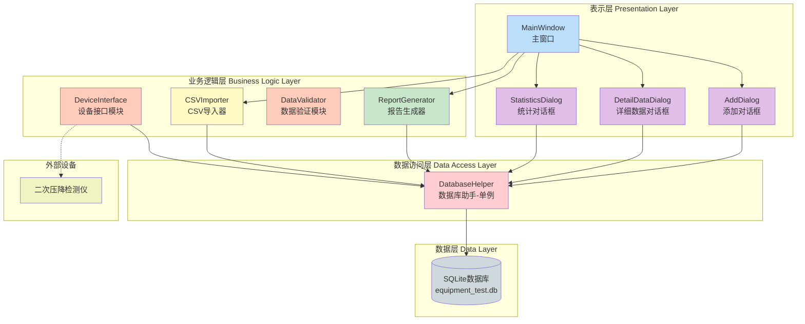
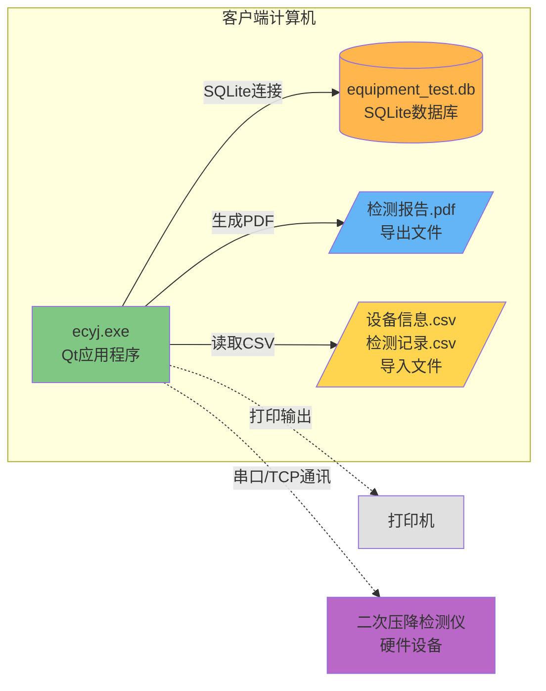
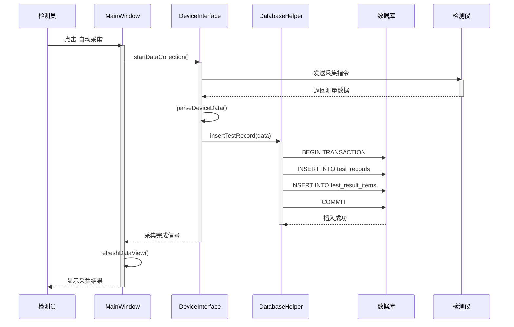
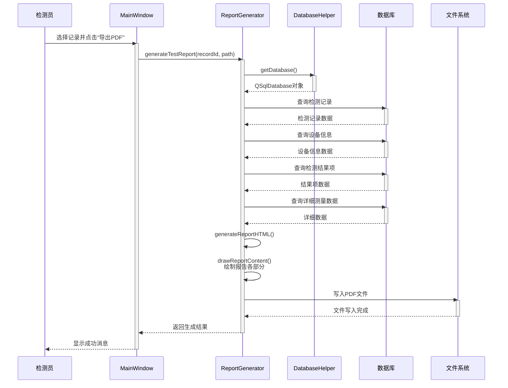
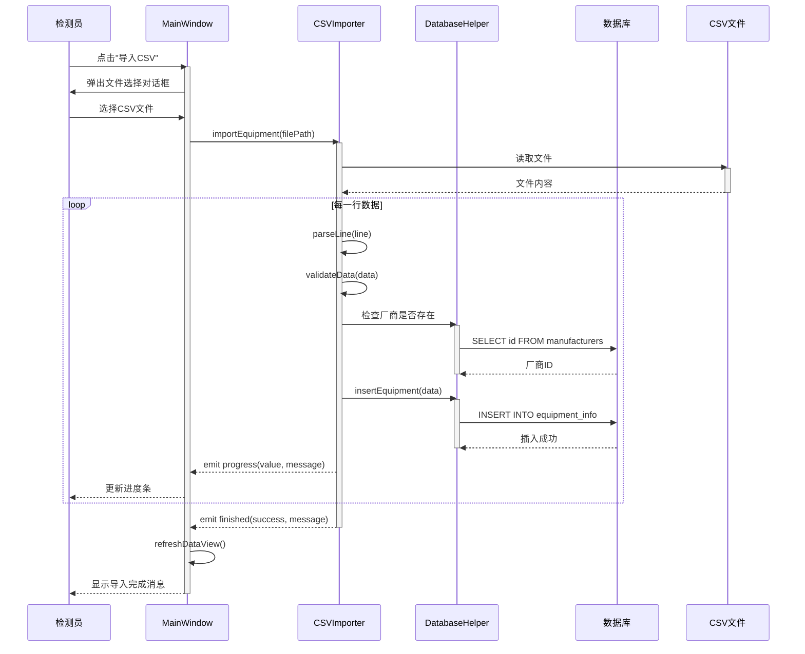
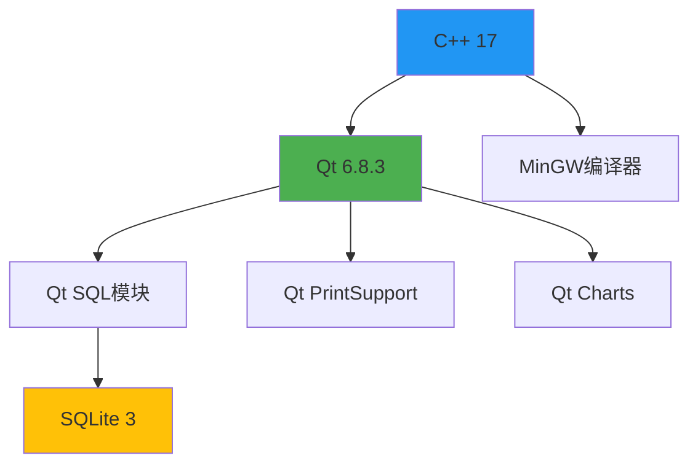

# 软件设计与体系结构考查报告

---

**姓名：** [请填写]  
**学号：** [请填写]  
**班级：** [请填写]  
**学院：** [请填写]  
**题目：** 《互感器二次压降检测仪检定系统》质量属性分析与体系结构设计  
**指导教师：** 王勇

**完成时间：** 2026年1月

---

## 目录

- [第1章 引言](#第1章-引言)
  - [1.1 项目背景](#11-项目背景)
  - [1.2 系统概述](#12-系统概述)
  - [1.3 报告组织结构](#13-报告组织结构)
- [第2章 系统架构设计](#第2章-系统架构设计)
  - [2.1 三层架构设计](#21-三层架构设计)
  - [2.2 部署架构设计](#22-部署架构设计)
  - [2.3 关键业务流程设计](#23-关键业务流程设计)
  - [2.4 技术栈选型及理由](#24-技术栈选型及理由)
- [第3章 软件质量属性分析与应答策略](#第3章-软件质量属性分析与应答策略)
  - [3.1 性能分析与应答策略](#31-性能分析与应答策略)
  - [3.2 可靠性分析与应答策略](#32-可靠性分析与应答策略)
  - [3.3 可用性分析与应答策略](#33-可用性分析与应答策略)
  - [3.4 可维护性分析与应答策略](#34-可维护性分析与应答策略)
  - [3.5 安全性分析与应答策略](#35-安全性分析与应答策略)
- [第4章 质量属性策略验证](#第4章-质量属性策略验证)
  - [4.1 验证方法概述](#41-验证方法概述)
  - [4.2 性能验证方案](#42-性能验证方案)
  - [4.3 可靠性验证方案](#43-可靠性验证方案)
  - [4.4 安全性验证方案](#44-安全性验证方案)
- [第5章 总结](#第5章-总结)
  - [5.1 结论与体会](#51-结论与体会)
  - [5.2 存在的问题](#52-存在的问题)
  - [5.3 未来工作展望](#53-未来工作展望)
- [参考文献](#参考文献)

---

## 第1章 引言

### 1.1 项目背景

互感器二次压降是电力系统中影响计量精度的重要因素。互感器二次回路中因导线电阻、接触电阻等因素产生的电压损失会直接影响电能计量的准确性。根据国家电网相关规定，互感器二次压降需要定期检定，以确保计量设备的准确性和可靠性。

传统的互感器二次压降检定工作主要依靠手工记录和纸质报告，存在以下问题：
- 数据记录效率低，容易出错
- 历史数据难以查询和统计
- 报告生成繁琐，格式不统一
- 检定结果无法实时共享

为解决上述问题，开发一套互感器二次压降检测仪检定软件系统具有重要的现实意义。该系统不仅可以提高检定工作的效率和质量，还能为设备管理和决策提供数据支持。

### 1.2 系统概述

本系统是一套面向电力检定人员的桌面应用软件，主要功能包括：

1. **数据输入管理**：支持手动添加和CSV批量导入两种方式
2. **数据管理**：管理厂商信息、设备信息、检测记录、检测结果项和详细测量数据
3. **查询统计**：支持按时间段、厂商、月份等多维度统计分析
4. **报告生成**：自动生成符合标准格式的PDF检定报告
5. **设备采集**：支持与二次压降检测仪的自动数据采集（预留接口）

系统采用三层架构设计，前端使用Qt 6.8.3框架实现跨平台桌面应用，后端使用C++实现业务逻辑，数据存储采用SQLite 3本地数据库。系统设计遵循高内聚低耦合原则，确保良好的可扩展性和可维护性。

### 1.3 报告组织结构

本报告共分为五章：

- **第1章（引言）**：介绍项目背景、系统概述和报告结构。
- **第2章（系统架构设计）**：详细阐述系统的三层架构、部署架构、关键业务流程以及技术栈选型理由。
- **第3章（软件质量属性分析与应答策略）**：针对性能、可靠性、可用性、可维护性、安全性五个质量属性，分别给出质量场景分析和具体的应答策略。
- **第4章（质量属性策略验证）**：提出验证方法和实验方案，确保系统设计能够满足质量目标。
- **第5章（总结）**：总结设计成果，分析存在的问题，并展望未来工作。

---

## 第2章 系统架构设计

### 2.1 三层架构设计

系统采用经典的三层架构模式，将应用程序划分为表示层（Presentation Layer）、业务逻辑层（Business Logic Layer）和数据访问层（Data Access Layer）三个逻辑层次。这种分层设计使得系统具有良好的可维护性和可扩展性。

#### 2.1.1 架构视图

**图2-1 系统三层架构图**

#### 2.1.2 各层职责说明

**（1）表示层（Presentation Layer）**

表示层负责与用户交互，接收用户输入并展示处理结果。主要组件包括：

- **MainWindow（主窗口）**：系统的主控制器，管理整体界面布局，协调各个子模块的工作。提供菜单栏、工具栏和主数据表格视图。
- **AddDialog（添加对话框）**：处理各类数据的手动添加操作，支持厂商、设备、检测记录、结果项的录入。
- **DetailDataDialog（详细数据对话框）**：专门用于编辑和管理检测记录的详细测量数据（ao/bo/co测量点数据）。
- **StatisticsDialog（统计对话框）**：提供多维度的数据统计分析功能，支持表格和图表双重展示。

表示层的设计遵循MVC模式，视图组件只负责显示，不包含业务逻辑。

**（2）业务逻辑层（Business Logic Layer）**

业务逻辑层封装了系统的核心业务规则和处理流程，主要组件包括：

- **ReportGenerator（报告生成器）**：根据检测记录生成符合标准格式的PDF报告，支持打印输出。
- **CSVImporter（CSV导入器）**：实现CSV文件的解析和批量数据导入，支持厂商、设备、检测记录三种数据类型。
- **DataValidator（数据验证模块）**：对用户输入和导入的数据进行格式验证、完整性检查和业务规则校验。
- **DeviceInterface（设备接口模块）**：预留的硬件设备通讯接口，用于与二次压降检测仪进行数据采集（支持串口、TCP等通讯方式）。

业务逻辑层通过依赖注入方式调用数据访问层，降低了层间耦合度。

**（3）数据访问层（Data Access Layer）**

数据访问层负责封装所有数据库操作，对上层提供统一的数据访问接口：

- **DatabaseHelper（数据库助手）**：采用单例设计模式，确保全局唯一的数据库连接对象。提供数据库初始化、表创建、CRUD操作、事务管理等功能。所有需要访问数据库的组件都通过该单例对象进行操作，避免了数据库连接的重复创建和资源浪费。

**（4）数据层（Data Layer）**

数据层使用SQLite 3本地数据库，存储系统的所有业务数据。数据库包含5个核心数据表：
- manufacturers（厂商信息表）
- equipment_info（设备信息表）
- test_records（检测记录表）
- test_result_items（检测结果项表）
- test_result_details（详细测量数据表）

#### 2.1.3 架构优势

三层架构设计为系统带来以下优势：

1. **职责清晰**：每一层只关注自己的职责，降低了系统复杂度。
2. **低耦合**：层与层之间通过接口通信，修改某一层的实现不影响其他层。
3. **易测试**：可以独立测试每一层的功能，便于单元测试和集成测试。
4. **可扩展**：需要添加新功能时，只需在对应层添加新组件，不影响现有结构。
5. **可维护**：代码组织清晰，便于理解和维护。

---

### 2.2 部署架构设计

部署架构描述了系统在物理环境中的部署方式，包括软件组件、硬件设备以及它们之间的通讯关系。

#### 2.2.1 部署架构图

**图2-2 系统部署架构图**

#### 2.2.2 部署说明

**（1）客户端计算机**

系统运行在Windows操作系统的PC机上，包含以下组件：

- **ecyj.exe**：基于Qt 6.8.3框架开发的桌面应用程序，使用MinGW 64位编译。无需安装，支持绿色部署。
- **equipment_test.db**：SQLite 3本地数据库文件，与应用程序位于同一目录，无需独立数据库服务器。
- **导出文件**：系统生成的PDF检定报告存储在指定目录。
- **导入文件**：用户准备的CSV格式数据文件，用于批量导入。

**（2）外部设备**

- **打印机**：通过Qt PrintSupport模块实现打印功能，支持网络打印机和本地打印机。
- **二次压降检测仪**：通过串口（RS232/RS485）或TCP/IP网络与客户端计算机通讯，实现自动数据采集（预留接口）。

#### 2.2.3 部署优势

1. **简单易部署**：单机部署，无需配置服务器环境，降低了部署成本和维护难度。
2. **数据本地化**：数据存储在本地，不依赖网络，确保数据安全和访问速度。
3. **离线可用**：无需联网即可使用，适合现场检定工作环境。
4. **扩展灵活**：预留了设备通讯接口，可根据实际需求接入不同品牌的检测仪器。

---
### 2.3 关键业务流程设计

本节通过时序图展示系统的三个核心业务流程：数据采集、报告生成和批量导入。

#### 2.3.1 数据采集流程（预留接口）

**图2-3 数据采集流程时序图**

#### 2.3.2 PDF报告生成流程

**图2-4 PDF报告生成流程时序图**

#### 2.3.3 CSV批量导入流程

**图2-5 CSV批量导入流程时序图**

#### 2.3.4 流程设计说明

上述三个业务流程体现了系统的核心功能：

1. **数据采集流程**展示了系统如何与外部检测仪器交互，通过DeviceInterface模块实现硬件解耦，便于支持不同品牌的设备。

2. **报告生成流程**展示了从数据库查询多表关联数据、组装报告内容、生成PDF文件的完整过程，体现了系统的数据处理能力。

3. **批量导入流程**展示了系统如何处理大量数据的导入操作，通过信号机制实现异步进度反馈，提升用户体验。

---
### 2.4 技术栈选型及理由

#### 2.4.1 技术栈总览

| 层次 | 技术选型 | 版本 |
|-----|---------|------|
| 表示层 | Qt Framework | 6.8.3 |
| 编程语言 | C++ | C++17 |
| 编译器 | MinGW | 64-bit |
| 数据库 | SQLite | 3.x |
| PDF生成 | Qt PrintSupport | 6.8.3 |
| 图表绘制 | Qt Charts | 6.8.3 |

**表2-1 系统技术栈**

#### 2.4.2 前端框架选择：Qt 6.8.3

**选择理由：**

1. **跨平台能力**：Qt是成熟的跨平台C++图形界面框架，支持Windows、Linux、macOS，便于未来系统移植。

2. **丰富的组件库**：Qt提供了完善的UI组件（QTableView、QDialog、QChart等），可快速构建专业的桌面应用界面，减少开发时间。

3. **信号槽机制**：Qt的信号槽机制是一种类型安全的回调机制，非常适合处理异步事件（如CSV导入进度通知），代码清晰易维护。

4. **模块化设计**：Qt Modules（Qt Core、Qt GUI、Qt SQL、Qt PrintSupport）分工明确，可按需引入，避免程序臃肿。

5. **原生性能**：基于C++开发，运行效率高，适合处理大量数据和复杂计算。

6. **文档完善**：Qt拥有完善的官方文档和活跃的社区支持，降低了学习成本和技术风险。

**技术对比：**

| 框架 | 优势 | 劣势 | 是否适合 |
|-----|------|------|---------|
| Qt | 跨平台、性能高、组件丰富 | 体积较大 | ✅ 适合 |
| Electron | 前端技术栈、开发快 | 资源占用高、性能差 | ❌ 不适合 |
| WinForms | Windows原生 | 仅支持Windows | ❌ 不适合 |
| WPF | 界面美观 | 仅支持Windows | ❌ 不适合 |

**表2-2 前端框架对比**

#### 2.4.3 编程语言选择：C++

**选择理由：**

1. **高性能**：C++编译为本地机器码，运行效率远高于解释型语言，适合处理大量检定数据和实时设备通讯。

2. **与Qt无缝集成**：Qt本身使用C++开发，使用C++开发可充分利用Qt的所有特性，避免语言绑定带来的性能损耗。

3. **内存控制**：C++提供精确的内存管理能力，对于长时间运行的桌面应用非常重要，可避免内存泄漏。

4. **硬件接口友好**：C++可直接调用Windows API和串口通讯库，便于实现与检测仪器的底层通讯。

5. **面向对象**：C++支持完善的面向对象特性（继承、多态、封装），有利于实现三层架构和设计模式。

#### 2.4.4 数据库选择：SQLite 3

**选择理由：**

1. **无需服务器**：SQLite是嵌入式数据库，以单一文件形式存储，无需安装和配置数据库服务器，大幅降低部署复杂度。

2. **轻量高效**：数据库文件体积小，查询性能优秀，适合单机应用场景。

3. **ACID保证**：支持事务处理，确保数据一致性和可靠性。

4. **跨平台**：SQLite数据库文件在不同操作系统间完全兼容，便于数据迁移和备份。

5. **零配置**：应用程序启动时自动创建和连接数据库，用户无感知，降低使用门槛。

6. **Qt原生支持**：Qt SQL模块原生支持SQLite，通过QSqlDatabase、QSqlTableModel等类可轻松操作数据库。

**技术对比：**

| 数据库 | 优势 | 劣势 | 是否适合 |
|-------|------|------|---------|
| SQLite | 无需服务器、部署简单 | 不支持高并发 | ✅ 适合单机应用 |
| MySQL | 功能强大、支持高并发 | 需要服务器配置 | ❌ 过于复杂 |
| Access | Windows集成 | 仅支持Windows、性能差 | ❌ 不适合 |

**表2-3 数据库对比**

#### 2.4.5 PDF生成选择：Qt PrintSupport

**选择理由：**

1. **原生集成**：Qt PrintSupport是Qt的官方模块，与Qt GUI无缝集成，可直接使用QPainter绘制报告内容。

2. **格式控制精确**：可像绘图一样精确控制报告的每个元素位置、字体、颜色，满足检定报告的严格格式要求。

3. **支持打印和导出**：既支持直接打印到物理打印机，也支持导出为PDF文件，一套代码实现两种功能。

4. **中文支持良好**：完美支持中文字体和编码，避免乱码问题。

#### 2.4.6 技术栈适配性分析

所选技术栈之间的适配性如下图所示：

**图2-6 技术栈依赖关系图**

整个技术栈以Qt为核心，各模块之间协同工作，形成了一个稳定、高效、易维护的技术体系。这种选型充分考虑了系统的性能需求、开发效率、部署便利性和未来扩展性，是互感器检定系统的最佳技术方案。

---
## 第3章 软件质量属性分析与应答策略

本章针对系统的五个关键质量属性进行深入分析，采用质量属性场景（Quality Attribute Scenario, QAS）的方法描述质量需求，并提出相应的架构应对策略和技术实现方案。

